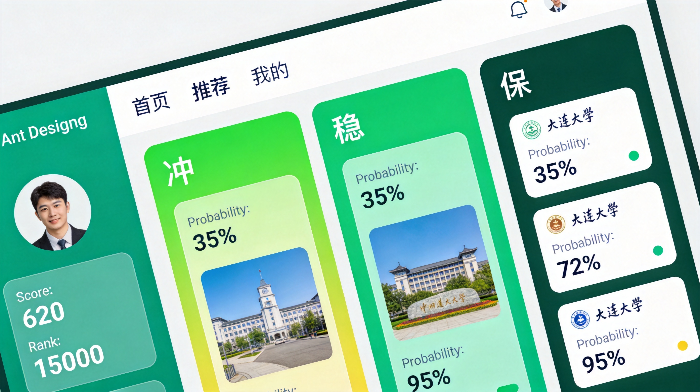
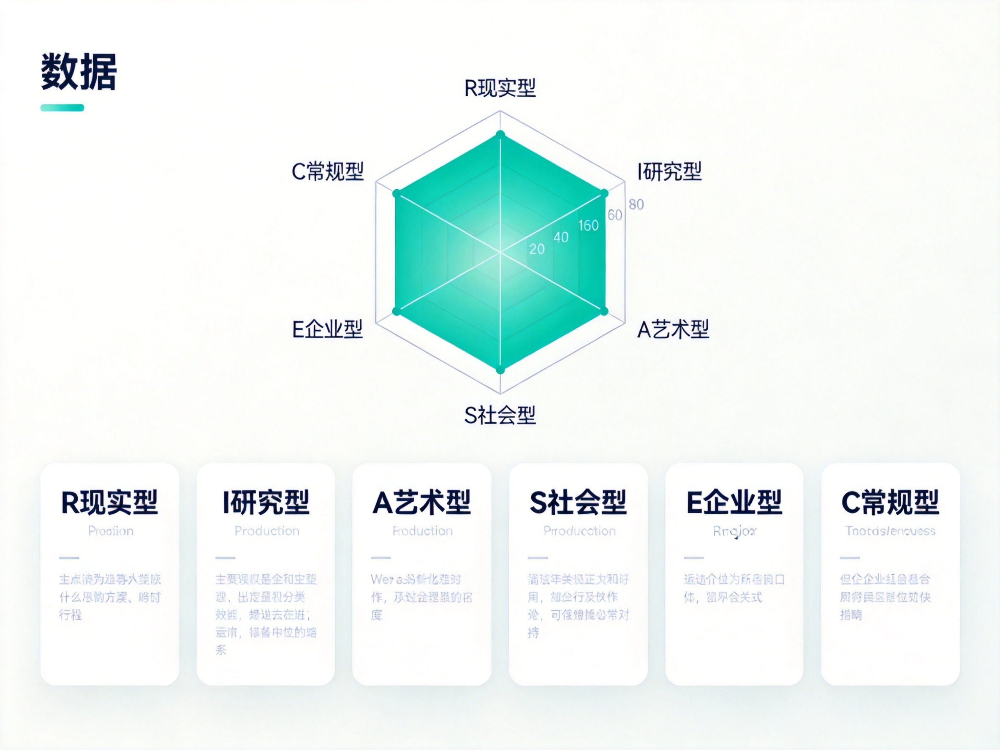
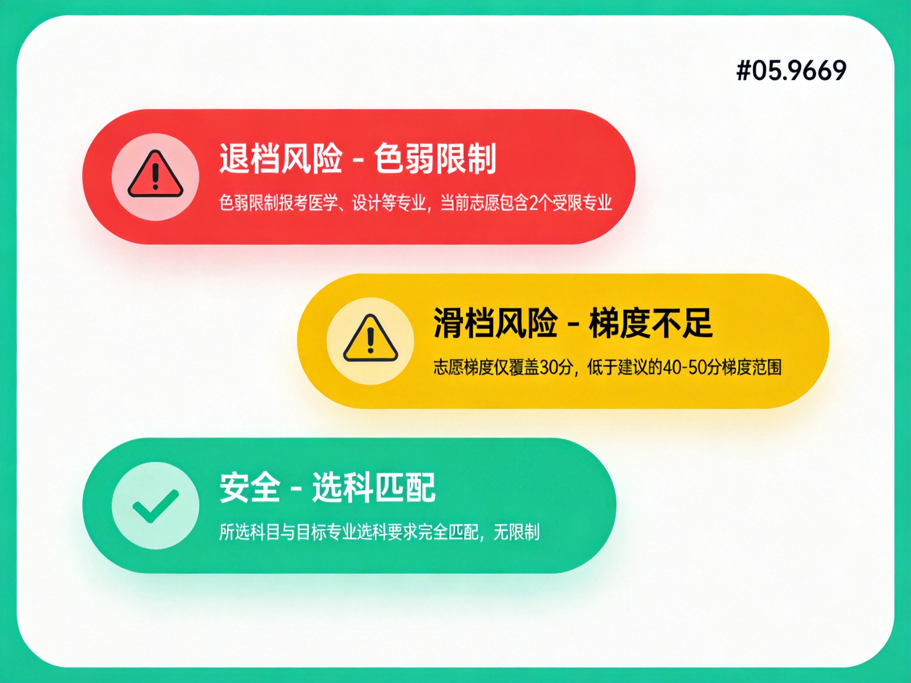

<h1 align="center">🎓 GaoKao Volunteer Assistant</h1>

<p align="center">
  <strong>AI-powered college admission recommendation for China's National College Entrance Exam</strong>
</p>

<p align="center">
  <a href="#features">Features</a> •
  <a href="#quick-start">Quick Start</a> •
  <a href="#demo">Demo</a> •
  <a href="#architecture">Architecture</a> •
  <a href="#data-coverage">Data Coverage</a> •
  <a href="#contributing">Contributing</a> •
  <a href="./README.md">中文</a>
</p>

<p align="center">
  
  
  
  
  
  
  
</p>

<p align="center">
  
  
  
  
</p>

<p align="center">
  <em>🤖 Built end-to-end with <strong>TRAE + GLM-5.2 + Kimi-K2.7-Code</strong> — from requirements and design to code</em>
</p>

---

## 🤖 Built Entirely with AI

> **This project is an AI-Native development experiment** —— from requirements analysis, tech selection and architecture design, to implementation, testing and documentation, **everything was produced collaboratively by large language models inside [TRAE](https://www.trae.ai/)**, with humans steering direction and reviewing results.

| AI Tool | Role | Description |
|---------|------|-------------|
| 🛠️ **TRAE** | AI-native IDE | The end-to-end dev environment driving task breakdown, code generation, debugging and refactoring |
| 🧠 **GLM-5.2** | Architecture & reasoning | Requirements understanding, technical design, complex reasoning and data modeling |
| ⚡ **Kimi-K2.7-Code** | Coding & engineering | Code generation, component implementation, unit tests and engineering delivery |

**What this means:** Every module, every algorithm (e.g. equivalent-rank methodology, weighted probability model) and every doc in this repo was produced by the AI tools above. It is an open sample for validating whether **AI can independently deliver a complete, production-ready real product**. Explore the [Architecture](#architecture) and source code to judge the AI's engineering capability yourself.


---

## Why This Project?

In 2026, China's GaoKao (National College Entrance Exam) has **12.9 million** candidates. Filling college application preferences ("志愿填报") is one of the most stressful decisions, yet:

| Problem | Reality |
|---------|---------|
| 🔒 **Information Gap** | ~30% of students have zero knowledge of admission rules |
| 💰 **Resource Gap** | Professional consulting costs $400-$2,600; only 5% of families can afford it |
| ⚠️ **Quality Gap** | Existing AI tools have a **31.2% policy-matching error rate** |

**Volunteer Assistant** provides professional-grade admission planning for **free**, with a focus on accuracy, explainability, and offline capability — especially for underserved rural students.

---

## Features

<table>
<tr>
<td width="50%">

### 🎯 Smart Rush-Stable-Safe Recommendations
- Equivalent-rank methodology + weighted probability model
- Supports 7 provincial quota configurations (24-112 slots)
- Multi-dimensional sorting: probability / tier / interest / region / tuition
- Every recommendation includes admission probability & data sources

</td>
<td width="50%">

### 🛡️ Risk Warning System
- Slip-through risk: gradient detection, safety floor check, volatility analysis
- Rejection risk: subject match, physical exam limits, single-subject minimums
- Red / Yellow / Green three-level alerts + specific fix suggestions
- Exportable risk reports

</td>
</tr>
<tr>
<td width="50%">

### 🧠 Holland / MBTI / Subject Interest Assessment
- 60-question Holland RIASEC test → hexagonal radar chart
- MBTI personality-major matching
- 15-question subject interest test → recommended disciplines
- Cross-validation & integration of multiple assessment results

</td>
<td width="50%">

### 💬 AI Chat Consultation (Optional)
- Any OpenAI-compatible API (GLM / Qwen / DeepSeek / etc.)
- Policy Q&A + recommendation explanation + college consulting
- Streaming output + Markdown rendering
- API Key encrypted locally, never uploaded

</td>
</tr>
<tr>
<td width="50%">

### 📊 Data Center
- Query colleges / majors / score lines / rank tables
- Multi-condition filtering & sorting
- Equivalent rank converter tool
- Sources: Ministry of Education, provincial exam authorities

</td>
<td width="50%">

### ⚡ Pure Frontend & Offline Ready
- No backend required, zero-cost deployment
- Data stored in IndexedDB, works offline
- First paint < 2s, recommendation < 3s
- PWA offline support (planned)

</td>
</tr>
</table>

---

## Demo

### 🎯 Smart Recommendation — Rush / Stable / Safe Tiers

<p align="center">
  
</p>

> Enter your score and rank, and the AI generates a Rush/Stable/Safe three-tier plan with admission probabilities and data provenance.

### 🧠 Interest Assessment — Holland RIASEC Radar

<p align="center">
  
</p>

> A 60-question Holland test produces a RIASEC hexagonal radar chart to match your personality to suitable majors.

### 🛡️ Risk Report — Slip-through & Rejection Detection

<p align="center">
  
</p>

> Automatically scans your preference list for slip-through and rejection risks with actionable fix suggestions.

---

## Quick Start

### Prerequisites

- **Node.js** >= 18.0
- **npm** >= 9.0 (or pnpm / yarn)

### Installation

```bash
# Clone the repository
git clone https://github.com/your-username/gaokao-advisor.git
cd gaokao-advisor

# Install dependencies
npm install
```

### Development

```bash
# Start dev server (includes LLM proxy for CORS bypass)
npm run dev

# Open in browser
# http://localhost:5173
```

### Build

```bash
# Type-check + production build
npm run build

# Preview production build
npm run preview
```

### Testing

```bash
# Run all scraper tests
npm run test:scrapers

# Watch mode
npm run test:scrapers:watch
```

---

## Architecture

### Tech Stack

| Category | Technology | Purpose |
|----------|-----------|---------|
| Framework | React 18 + TypeScript 5 | Type safety, mature ecosystem |
| Bundler | Vite 5 | Fast HMR, on-demand builds |
| UI | Ant Design 5 + Tailwind CSS 3 | Beautiful defaults + utility-first customization |
| Animation | Framer Motion 11 | Page transitions, interaction feedback |
| State | Zustand 5 + persist middleware | Lightweight, auto-persisted |
| Storage | Dexie.js (IndexedDB) + localStorage | Layered storage, offline-capable |
| Charts | ECharts 5 | Radar charts, trend lines |
| Testing | Vitest + React Testing Library | Unit + integration tests |
| Quality | ESLint + TypeScript strict | Strict type checking |
| 🤖 AI Dev | TRAE + GLM-5.2 + Kimi-K2.7-Code | End-to-end AI-assisted development: requirements, design, code, tests |

### Project Structure

```
gaokao-advisor/
├── public/data/               # Static JSON data
│   ├── common/                # Colleges, majors, mappings
│   ├── scores/                # Admission scores (10 provinces)
│   ├── subjects/              # Subject requirements
│   └── assessment/            # Assessment questions
├── src/
│   ├── components/            # Global components
│   ├── features/              # Feature modules
│   │   └── assessment/        # Holland / MBTI / Subject tests
│   ├── pages/                 # Page components
│   ├── services/              # Core business logic
│   │   ├── recommender.ts     # Recommendation engine
│   │   ├── rankConverter.ts   # Rank conversion
│   │   ├── rankScorer.ts      # Multi-dimensional scoring
│   │   ├── riskDetector.ts    # Risk detection
│   │   ├── chat.ts            # LLM client
│   │   └── dataLoader.ts     # Data loader
│   ├── store/                 # Zustand global state
│   └── styles/                # Global styles + theme
├── scripts/scrapers/          # Data pipeline
│   ├── colleges/              # College info scraper
│   ├── scores/                # Score line scraper (10 adapters)
│   ├── rank_tables/           # Rank table scraper
│   ├── majors/                # Major catalog scraper
│   └── subjects/              # Subject requirement scraper
└── docs/                      # Documentation
```

### Core Algorithm Pipeline

```
User Profile (score / rank / subjects / preferences)
        │
        ▼
[1] Equivalent Rank Conversion — cross-year historical alignment
        │
        ▼
[2] Candidate Filtering — subject / physical / tuition / region
        │
        ▼
[3] Admission Probability — weighted average + volatility correction
        │
        ▼
[4] Rush-Stable-Safe Division — probability mapping + provincial quotas
        │
        ▼
[5] Multi-dimensional Sorting — 6-factor weighted scoring
        │
        ▼
[6] Recommendation Rationale + Data Provenance
```

---

## Data Coverage

### Supported Provinces (10)

| Province | Quota | Mode |
|----------|-------|------|
| 🟢 Zhejiang | 80 | Major + College |
| 🟢 Shandong | 96 | Major + College |
| 🟢 Hebei | 96 | Major + College |
| 🟢 Liaoning | 112 | Major + College |
| 🟢 Jiangsu | 40 | College Group |
| 🟢 Hubei | 45 | College Group |
| 🟢 Hunan | 45 | College Group |
| 🟢 Guangdong | 45 | College Group |
| 🟢 Beijing | 30 | College Group |
| 🟢 Shanghai | 24 | College Group |

### Data Pipeline

The project includes a full scraping pipeline with per-province adapters:

```bash
# Scrape college info
npm run scrape:colleges

# Scrape admission scores (all 10 provinces)
npm run scrape:scores

# Scrape rank tables
npm run scrape:rank_tables

# Run all scrapers
npm run scrape:all
```

---

## Roadmap

- [x] Core recommendation engine (Rush / Stable / Safe)
- [x] Holland / MBTI / Subject interest assessments
- [x] Risk warning system
- [x] AI chat (OpenAI-compatible)
- [x] Data center + equivalent rank converter
- [x] Volunteer list management (multi-scheme compare / export)
- [x] 10-province data pipeline
- [ ] PWA offline support
- [ ] Expand to all 29 new-exam provinces
- [ ] Dark mode polish
- [ ] GitHub Pages auto-deploy
- [ ] E2E tests (Playwright)

---

## Contributing

Contributions are welcome! Whether it's fixing bugs, adding province data adapters, or improving the UI — we'd love your help.

### How to Contribute

1. **Fork** this repository
2. Create a feature branch: `git checkout -b feature/amazing-feature`
3. Commit your changes: `git commit -m 'feat: add amazing feature'`
4. Push the branch: `git push origin feature/amazing-feature`
5. Open a **Pull Request**

### Development Guidelines

- TypeScript strict mode, no `any` allowed
- Functional components + Hooks
- State management via Zustand
- Prefer Tailwind CSS for styling
- Follow [Conventional Commits](https://www.conventionalcommits.org/)
- New data adapters must include unit tests

### Adding a Province Adapter

See existing adapters under `scripts/scrapers/scores/adapters/` for reference. Each adapter handles the specific data format of a provincial exam authority.

---

## License

This project is licensed under the [MIT License](LICENSE).

---

## Acknowledgments

- [Ant Design](https://ant.design/) — Excellent React UI library
- [Tailwind CSS](https://tailwindcss.com/) — Utility-first CSS framework
- [ECharts](https://echarts.apache.org/) — Powerful data visualization
- [Zustand](https://github.com/pmndrs/zustand) — Lightweight state management
- [Vite](https://vitejs.dev/) — Blazing fast build tool
- Ministry of Education & Provincial Exam Authorities — Data sources

---

<p align="center">
  <sub>Made with ❤️ for 12.9 million GaoKao candidates</sub>
</p>
